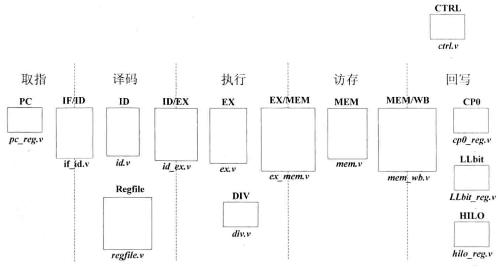

# 项目整体架构

# 项目说明
## 取指阶段
PC 模块：给出指令地址，其中实现指令指针寄存器PC，该寄存器的值就是指令地址，对应pc_reg.v 文件

IF/ID 模块: 实现取指；与译码阶段之间的寄存器，将取指阶段的结果(取得的指令、指令地址等信息) 在下一个时钟传递到译码阶段，对应 if_id.v 文件

## 译码阶段
ID 模块: 对指令进行译码，译码结果包括运算类型、运算所需的源操作数、要写入的目的寄存器地址，对应 id.v 文件

Regfile 模块: 实现了32个32位通用整数寄存器，可以同时进行两个寄存器的读操作和一个寄存器的写操作，对应 regfile.v 文件

ID/EX 模块: 实现译码与执行阶段之间的寄存器，将译码阶段的结果在下一个时钟周期传递到执行阶段，对应 id_ex.v 文件

## 执行阶段
EX 模块: 依据译码阶段的结果，进行指定的运算，给出运算结果。对应 ex.v 文件

DIV 模块: 进行除法运算的模块，对应 div.v 文件

EX/MEM 模块: 实现执行与访存阶段之间的寄存器，将执行阶段的结果在下一个时钟周期传递到访存阶段，对应 ex_mem.v 文件

## 访存阶段
MEM 模块: 如果是加载、存储指令，那么会对数据存储器进行访问。此外，还会在该模块进行异常判断。对应 mem.v 文件

MEM/WB 模块: 实现访存与回写阶段之间的寄存器，将访存阶段的结果在下一个时钟周期传递到回写阶段，对应 mem_wb.v 文件

## 回写阶段
